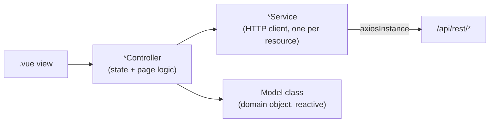

# Client architecture: controller / service / model

Every feature area under `client/src/views/` follows the same four-layer
pattern. Once you've seen it in one module (Books, say) the rest read the
same way - this document is that pattern in the abstract, plus the two
pieces of shared plumbing every page depends on: the axios instance and the
app-policy bootstrap.

## Contents

- [The four layers](#the-four-layers)
- [`BaseController`: the page lifecycle](#basecontroller-the-page-lifecycle)
- [The shared axios instance](#the-shared-axios-instance)
- [The policy bootstrap: `ApplicationService`](#the-policy-bootstrap-applicationservice)
- [Routing](#routing)
- [Internationalization](#internationalization)
- [Where this lives in code](#where-this-lives-in-code)

## The four layers



- **`views/`** - one folder per feature (`book/`, `authors/`, `customers/`,
  ...), holding the `.vue` files. Markup and layout only - a view reads
  reactive state off its controller and calls controller methods; it
  shouldn't call a `*Service` or build a request directly.
- **`controller/`** - one class per page, holding that page's state
  (loading/error/data) and orchestrating fetches. Every one extends
  [`BaseController`](#basecontroller-the-page-lifecycle).
- **`service/`** - one class per backend *resource* (`BookService`,
  `CustomersService`, `LoansService`, ...), each a thin wrapper translating
  method calls into `axiosInstance` requests against `/api/rest/<resource>`.
  Services hold no state - purely stateless HTTP clients, instantiated once
  as a module-level singleton (`export const bookService = new BookService()`).
- **`model/`** - domain classes (`Book`, `BookStock`, `Customer`, `Location`,
  ...) that wrap the raw `I*` interfaces returned by the API in Vue-reactive
  state plus behavior (e.g. `BookStock.update()` calls back into
  `BookService` and syncs its own reactive fields from the response,
  `Book.isElectronic()` derives a boolean from `format_id`). A `types/`
  interface (`IBook`, `ICustomer`, ...) is the wire shape; the `model/`
  class is what the rest of the app actually holds onto and renders from.

This mirrors the server side one-for-one: a `*Service` in `client/src/service/`
talks to exactly one `*Route.ts` in `server/src/routes/`, and the `I*` types
in `client/src/types/` are meant to match that route's JSON shapes (see each
route's own JSDoc for the authoritative response shape - the `types/` files
don't repeat every field's meaning, just its shape).

## `BaseController`: the page lifecycle

[`BaseController<I>`](../client/src/controller/BaseController.ts) exists so
every page controller gets the same loading/error/data lifecycle without
reimplementing it:

```ts
class FooController extends BaseController<IFoo> {
  constructor() { super("Foo"); }               // sets document.title
  async fetchData() { return fooService.getData(); }   // called once, on construction
  setData(data: IFoo | null) { this.m_foo = data ? new Foo(data) : null; }
}
```

A subclass implements exactly two methods:

- **`fetchData()`** - call the relevant `*Service` method(s) and return the
  raw response.
- **`setData(data)`** - turn that raw response into whatever reactive model
  state the subclass exposes (a single model instance, an array, several
  fields - `BaseController` doesn't care, it just guarantees `setData` runs
  exactly once per successful fetch).

`BaseController` itself tracks `isLoading()`/`hasError()`/`getError()`/
`hasData()`/`getData()` as Vue refs, all driven by a single
`protected __fetchData()` called once from the constructor - there's no
built-in refetch/refresh method; a controller that needs to reload calls
`fetchData()`/`setData()` again itself (see `BookController` for the
simplest possible example: read a route param, fetch, wrap in a `Book`).

## The shared axios instance

Every `*Service` imports the same
[`axiosInstance`](../client/src/plugins/axiosInstance.ts) rather than
calling `axios` directly. It centralizes two things every request needs:

- **`withCredentials: true`** - always sends the httpOnly session cookie
  (see [AUTHENTICATION.md](AUTHENTICATION.md)); no service has to remember
  this per-call.
- **A response interceptor** that:
  1. Detects `401 { sessionExpired: true }` and does a full
     `window.location.href = "/login"` navigation - the one case that
     should nuke the whole SPA rather than let a view handle the error
     itself (see AUTHENTICATION.md's [client behavior on session
     death](AUTHENTICATION.md#what-the-client-does-when-a-session-dies)).
  2. Otherwise, unless the request opted out with
     `{ suppressErrorDialog: true }` (a non-standard axios config field read
     back out of `error.config`), shows the error in a global dialog
     (`errorDialogController`) - so most `*Service` methods don't need their
     own try/catch just to surface a failure to the user.

A caller that wants to render its own inline error UI instead of the global
dialog (e.g. batch ISBN import processing one item at a time) passes
`suppressErrorDialog: true` on that one request - see
`BookService.createBookFromIsbn()` for an example.

## The policy bootstrap: `ApplicationService`

[`ApplicationService`](../client/src/service/ApplicationService.ts) is the
one piece of genuinely global, app-wide state - not a per-page controller,
a singleton fetched once after login (`fetchPolicy()`, called from
`main.ts`/`App.vue` before the router renders anything). It holds:

- the current `User`,
- the reference lists every page's dropdowns need: `Category[]`,
  `Language[]`, `Format[]`, `Location[]`, `Customer[]` (see
  [CATALOG.md](CATALOG.md#the-policy-bootstrap)),
- and it's what registers the active i18n locale and its translated labels.

Any page that needs "the list of categories" or "the current user" reads it
from `applicationService.getCategories()` / `.getUser()` rather than
fetching its own copy - this is why, for instance, editing a book's category
dropdown doesn't make its own `/category` request.

`Router.ts`'s global `beforeEach` guard checks
`applicationService.hasError()` before every navigation - if the policy
fetch itself failed, no page is allowed to render (see
[AUTHENTICATION.md](AUTHENTICATION.md#what-the-client-does-when-a-session-dies)
for why this is defense-in-depth on top of, not instead of, server-side
auth).

## Routing

Each feature owns one file under `router/routes/` (`BookRoute.ts`,
`CustomersRoute.ts`, ...) exposing a singleton with `getRoute()` (a
`RouteRecordRaw`) and usually `getPath()`. [`Router.ts`](../client/src/router/Router.ts)
just collects all of them into one `routes` array - adding a new top-level
page means adding one new `router/routes/*Route.ts` file and one line in
`Router.ts`, not editing a giant central route table.

The whole SPA is mounted under the `/app` base path
(`createWebHistory('/app')`), matching the server's catch-all for
`/app`/`/app/*` in `AuthRoute.ts` that serves `index.html` for any
sub-path - this is what makes a hard refresh on, say, `/app/book/12` work
instead of 404ing.

## Internationalization

[`i18n.ts`](../client/src/plugins/i18n/i18n.ts) creates a `vue-i18n`
instance that starts **empty** (`messages: { en: {} }`) - there are no
bundled translation JSON files in the client. Every message key
(`AppLabels` enum) is resolved at runtime from the `labels` map in
`GET /app/policy`'s response, registered via
`i18n.global.setLocaleMessage(locale, labels)` in
`ApplicationService.fetchPolicy()`. Translations themselves live in the
database (`app_labels` table, one row per `{language, code}`), not in the
client bundle - editing a label, or adding a new language, doesn't require
a redeploy of the frontend. See the root README's
[Internationalization](../README.md#internationalization) section for the
full picture, including the *separate* Markdown-based `/docs` in-app help
pages, which are static per-language files rather than DB-backed labels.

## Where this lives in code

| Concern | File |
|---|---|
| Page lifecycle base class | `client/src/controller/BaseController.ts` |
| Shared axios instance + error handling | `client/src/plugins/axiosInstance.ts` |
| Global app state (user, reference lists, locale) | `client/src/service/ApplicationService.ts` |
| Router setup + auth/leasing guard | `client/src/router/Router.ts` |
| Per-feature route definitions | `client/src/router/routes/*.ts` |
| i18n instance | `client/src/plugins/i18n/i18n.ts` |
| Message key enum | `client/src/plugins/i18n/AppLabels.ts` |
| Vuetify setup | `client/src/plugins/vuetify.ts` |
| App shell / bootstrap sequence | `client/src/main.ts`, `client/src/App.vue` |
